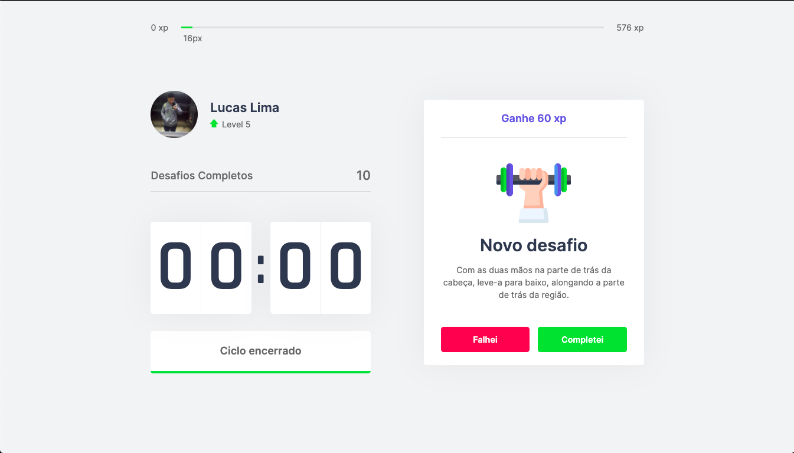

<p align="center">
  
</p>

# MoveIt 
 

> Técnica de Pomodoro | Desenvolvimento do **Move.it**, Utilizando Next.Js 

### 📄 O que foi usado:

- ReactJS
- NextJS
- Css
- Hooks
- Cookies
- ContextAPI
- Prettier

### 🎯 Funcionalidades:

>  Iniciar ciclo de tempo (25 min).
>  Realizar desafio para ganhar xp.
>  Subir de nível (Ou não) de acordo com o desafio.

### 🛠 Mão na massa:

> Você pode realizar o clone deste repositório ou baixar o arquivo .zip!

Clone o repositório:

````
git clone https://github.com/Lucaslimasz/Move.it-nlw4.git
````

Para baixar o zip: https://github.com/Lucaslimasz/Move.it-nlw4/archive/main.zip

### 💻 Executando o projeto 🚀

#### Na raiz do projeto, execute os comandos:

````
# Para instalar as dependências
yarn ou yarn install

# Para startar o projeto utilize
yarn dev
````
